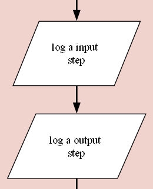

<div align="center">

</div>


[TOC]

# FunkyWeave
A `logger` that can be used to slow the `interactions between functions`, outputting `flow diagrams` in `dot format`, drawn using `Graphviz`.

## Installation

```
npm i funkyweave
```

## Usage

`FunkyWeave` comes in two parts, `logging` and `visualing`, both of which can be added to code by doing the following:

```
const { logger, visualiser } = require('funkyweave')
```

## Basic Logging

Logging is broken down into a number of simple steps

* `Start a log` or create a `child of an existing log` for a function
* Add process steps, detailing the `logic of that function`, using common `flow diagram symbols`, for example:
	* Start
	* Database
	* Decision
	* Input/Output
	* Process
	* End

### Start Log

To initialise `FunkyWeave logging`, there are 4 required field and a set of optional variables that can be passed into the start function, these are:

* Description: A text description printed in the `starting flow`. For example `start function`
* Group: Used to group one or more `flows` together. For example `page initialisation`, which would contain all flows run during the initialisation of a web-page. 
* Flow: Used to group one or more `sources` together. For example, `query user data`, `query shopping items` and `render page` could all be seperate flows within the same `page initialisation` group.
* Source: Used to group one or more `descriptions` together. For example, if you wished to seperate out `database queries`, `server functions` and `client-side functions`, each of these can exist as seperate sources within each flow.
* Options: **NEEDS DEFINING**

The below scipt is an example of how a user could initialise a `log instance` for use in a function:

```
const log = logger.start('start function', 'Room_Setup', 'Rooms_Setup', 'server')
```


Log instances should be created in each function you wish to visualise later.

### Database

```
log.database('log a database step')
```


### Decision

```
log.decision('log a decision step')
```


### Input/Output

```
log.input('log a input step')
```

```
log.output('log a output step')
```



### Process

```
log.process('log a process step')
```


### End

```
log.end('log the end step')
```


## Advanced Logging

### Loops

### ParentLog

### Start Child

### Orphans