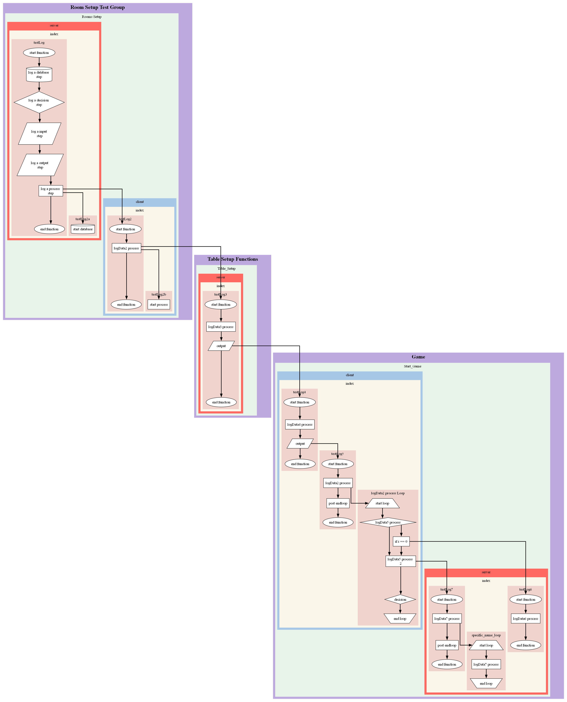

<div align="center">

</div>

# FunkyWeave

Have you ever wanted to `visualise the interactions` between each function in your program? **FunkyWeave** logging allows you to do it!

**FunkyWeave** is a light-weight `logger` that can be used to `visualise each step in logic`, outputting `flow diagrams` in `dot format` then drawn using `Graphviz` into multiple formats.



## Installation

```
npm i funkyweave
```

## Usage

**FunkyWeave** comes in two parts, `logging` and `visualing`, both of which can be added to code by doing the following:

```
const { logger, visualiser } = require('funkyweave')
```

## Further Reading

For more information on how **FunkyWeave** works, please take a look at the following documentation:

* [Basic Logging](/docs/basic_logging.md)
* [Node Types](/docs/nodes.md)
* [Advanced Logging](/docs/advanced_logging.md)
* [Visualising Flows](/docs/visualiser.md)