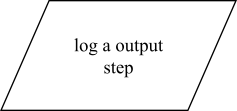
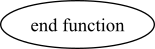
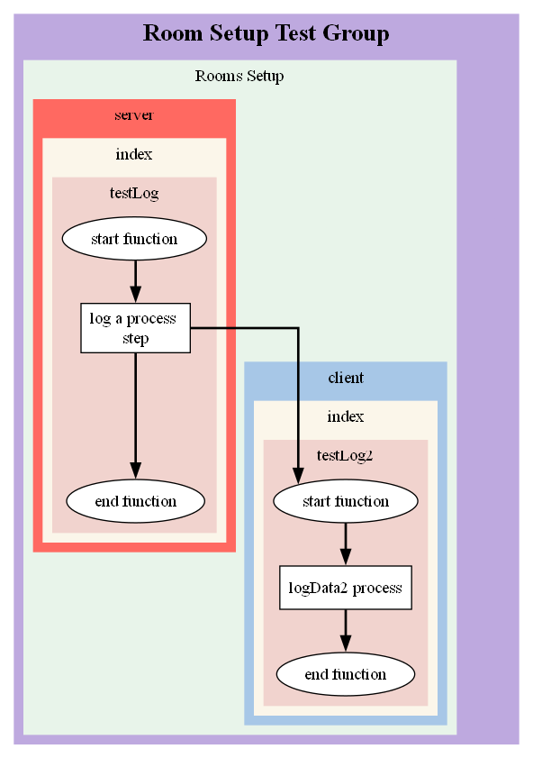

<div align="center">

</div>

# FunkyWeave

Have you ever wanted to `visualise the interactions` between each function in your program? **FunkyWeave** logging allows you to do it!

**FunkyWeave** is a light-weight `logger` that can be used to `visualise each step in logic`, outputting `flow diagrams` in `dot format` then drawn using `Graphviz` into multiple formats.

## Installation

```
npm i funkyweave
```

## Usage

**FunkyWeave** comes in two parts, `logging` and `visualing`, both of which can be added to code by doing the following:

```
const { logger, visualiser } = require('funkyweave')
```

## Basic Logging

Logging is broken down into a number of simple steps

* `Start a log` or create a `child of an existing log` for a function
* Add process steps, detailing the `logic of that function`, using common `flow diagram symbols`, for example:
	* Start
	* Database
	* Decision
	* Input/Output
	* Process
	* End

### Start Log

To initialise **FunkyWeave** `logging`, there are 4 required field and a set of optional variables that can be passed into the start function.

#### Function Definition

Source: **funkyweave.logging**

Name: **startLog**

Parameters:
* **Description (string)**: A text description printed in the `node`. For example `start function`.
* **Group (string)**: Used to group one or more `flows` together. For example `page initialisation`, which would contain all flows run during the initialisation of a web-page. 
* **Flow (string)**: Used to group one or more `sources` together. For example, `query user data`, `query shopping items` and `render page` could all be seperate flows within the same `page initialisation` group.
* **Source (string)**: Used to group one or more `descriptions` together. For example, if you wished to seperate out `database queries`, `server functions` and `client-side functions`, each of these can exist as seperate sources within each flow.
* **Options (object) Optional**: A object that contains additional configurations information.
	* **parentLog (Log)**: A log instance that can be used to link one flow to another flow.
	* **offset (int)**: A value used to offset where on the parentLog the flow join is made. This value defaults to 0 if not provided, useful when defining `switch` logs.
	* **directLink (obj)**: A object that can be used to join one object to another without having to pass in a parentLog. This can be used if it impractical to pass logs between functions. 
	* **parentGroup (string)**: If you'd prefer to join one group to another to demonstrate the functional flow, use this parameter to identify that parentGroup.
	* **parentFlow (string)**: If you'd prefer to join one flow to another to demonstrate the functional flow, use this parameter to identify that parentGroup

```
const log = startLog(
	Description,
	Group,
	Flow,
	Source,
	{
		parentFlow,
		offset,
		directLink,
		parentGroup,
		parentFlow
	}
)
```

The below script is an example of how a user could initialise a `log instance` for use in a function:

```
const log = logger.start('start function', 'Room_Setup', 'Rooms_Setup', 'server')
```

When the `log` is `initialised`, it will automatically create a `start` node:

**Expected output:**


Log instances should be created in each function you wish to visualise later.

## Nodes

Once a `log` is created the following `node styles` are available.

Every time a node is created, **FunkyWeave** will also extract the `file name` and `function name` the log was used in, which you will see detailed within the `complete flow examples`.

### Database

Should be used when directly interacting with a database or other data source.

#### Function Definition

Source: **funkyweave.log**

Name: **database**

Parameters:
* **Description (string)**: A text description printed in the `node`. For example "run step".
* **Orphan (boolean)**: A bool controlling where the node is treated as a [Orphan](#orphan) or not.

```
log.database(
	Description,
	Orphan
)
```

Here's an example:

```
log.database('log a database step')
```
**Expected output:**


### Decision

A node that can be used when detailing any if statements.

#### Function Definition

Source: **funkyweave.log**

Name: **decision**

Parameters:
* **Description (string)**: A text description printed in the `node`. For example "run step".
* **Orphan (boolean)**: A bool controlling where the node is treated as a [Orphan](#orphan) or not.

```
log.decision(
	Description,
	Orphan
)
```

Here's an example:

```
log.decision('log a decision step')
```
**Expected output:**


### Input

A node to show when data is taken into a flow.

#### Function Definition

Source: **funkyweave.log**

Name: **input**

Parameters:
* **Description (string)**: A text description printed in the `node`. For example "run step".
* **Orphan (boolean)**: A bool controlling where the node is treated as a [Orphan](#orphan) or not.

```
log.input(
	Description,
	Orphan
)
```

Here's an example:

```
log.input('log a input step')
```
**Expected output:**


### Output

A node to show when data is output from a flow.

#### Function Definition

Source: **funkyweave.log**

Name: **output**

Parameters:
* **Description (string)**: A text description printed in the `node`. For example "run step".
* **Orphan (boolean)**: A bool controlling where the node is treated as a [Orphan](#orphan) or not.

```
log.output(
	Description,
	Orphan
)
```
Here's an example:

```
log.output('log a output step')
```
**Expected output:**



### Process

A node that covers basic flow steps that aren't defined using any other type of node.

#### Function Definition

Source: **funkyweave.log**

Name: **process**

Parameters:
* **Description (string)**: A text description printed in the `node`. For example "run step".
* **Orphan (boolean)**: A bool controlling where the node is treated as a [Orphan](#orphan) or not.

```
log.process(
	Description,
	Orphan
)
```
Here's an example:

```
log.process('log a process step')
```
**Expected output:**


### End

To end a flow and save it, run the following:

#### Function Definition

Source: **funkyweave.log**

Name: **end**

Parameters:
* **Description (string)**: A text description printed in the `node`. For example "run step".

```
log.end(
	Description,
	Orphan
)
```

Here's an example:

```
log.end('log the end step')
```
**Expected output:**



## Example Flow

Here's a simple example of a single flow script:

```
# Saved within an index.js file
const { logger, visualiser } = require('funkyweave')

const testLog = () => {
	const log = logger.start('start function', 'Room Setup Test Group', 'Rooms Setup', 'server')
	log.database('log a database step')
	log.decision('log a decision step')
	log.input('log a input step')
	log.output('log a output step')
	log.process('log a process step')
	log.end('end function')
}

testLog()
```

Which should produce a flow that looks like this:


## Advanced Logging

Logging each function is great but what you really want to do is be able to link functions togther. For this we can use one of the following.

### Start Child

If the function you wish to detail is within the same Group, Flow, you pass the parentLog into the function and create a new logging instance from it using **startChild**.

You need to provide a `parentLog`, `description` and optionally, a new `source` for the log. Here's an example:

```
# Saved within an index.js file
const { logger, visualiser } = require('funkyweave')

const testLog = () => {
	const log = logger.start('start function', 'Room Setup Test Group', 'Rooms Setup', 'server')
	log.database('log a database step')
	testLog2(log)
	log.process('log a process step')
	log.end('end function')
}

const testLog2 = (parentLog) => {
	const log = logger.startChild(parentLog, 'start function', 'client')
	log.process('logData2 process')
	log.end('end function')
}

testLog()
```

Which should produce a flow that looks like this:



### ParentLog

Imagine this scenario, on the `client` side, a user presses a `start` button, which triggers a message to the `server` which in turn, queries a set of data that's return to the user populates a form for the `client`.

If we define `client` and `server` as two sources, the interaction above is actually detailing two seperate flows:
* A message sent from the `client` to the `server`.
* Data sent from the `server` to the `client`.

To link two flows together, we need to pass the `parentLog within the options object` when we start a new log.

#### Offset

#### Switch Statements

#### Directlink

### ParentGroup & ParentFlow

### Loops

#### startLoop

#### endLoop

### Orphans