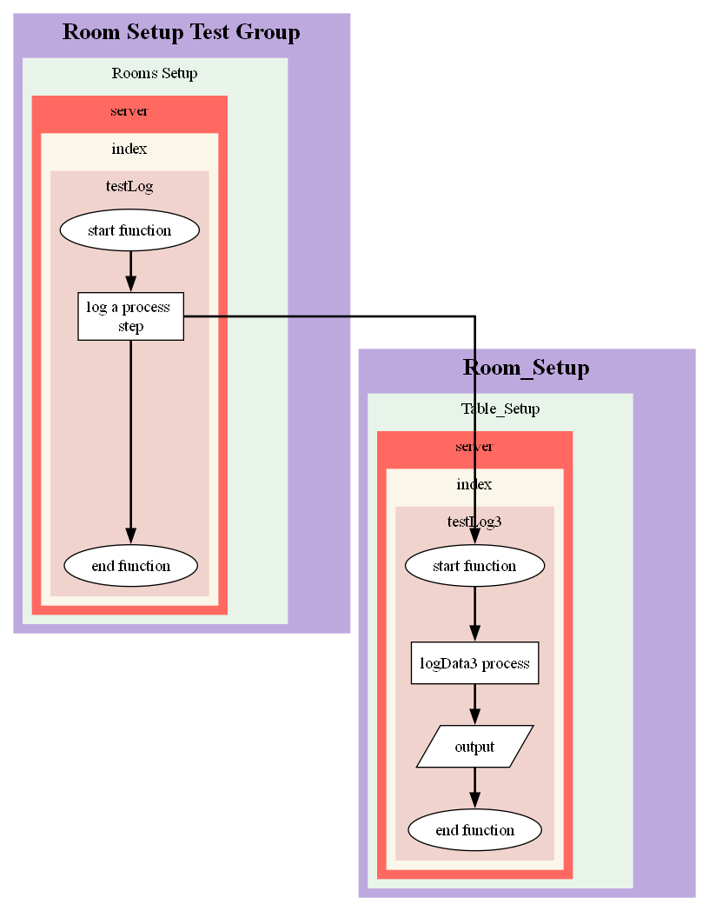
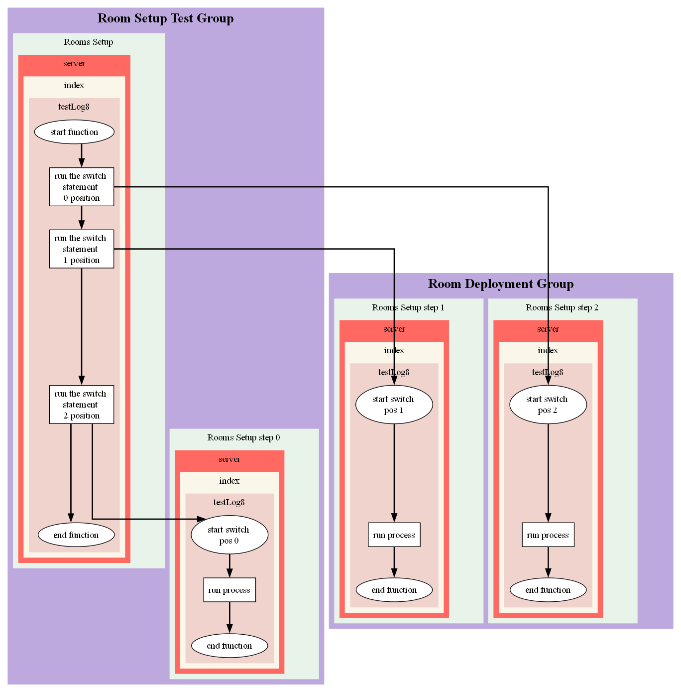
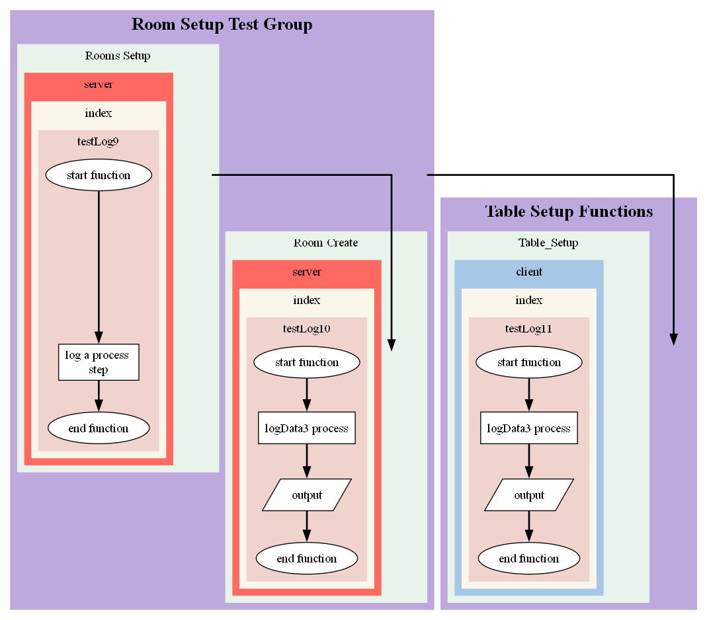

## Advanced Logging

Logging each function is great but what you really want to do is be able to link functions togther. For this we can use one of the following.

### Start Child

If the function you wish to detail is within the same Group, Flow, you pass the parentLog into the function and create a new logging instance from it using **startChild**.

You need to provide a `parentLog`, `description` and optionally, a new `source` for the log. Here's an example:

```
# Saved within an index.js file
const { logger, visualiser } = require('funkyweave')

const testLog = () => {
	const log = logger.start('start function', 'Room Setup Test Group', 'Rooms Setup', 'server')
	log.database('log a database step')
	testLog2(log)
	log.process('log a process step')
	log.end('end function')
}

const testLog2 = (parentLog) => {
	const log = logger.startChild(parentLog, 'start function', 'client')
	log.process('logData2 process')
	log.end('end function')
}

testLog()
```

Which should produce a flow that looks like this:


### ParentLog

Imagine this scenario, on the `client` side, a user presses a `start` button, which triggers a message to the `server` which in turn, queries a set of data that's return to the user populates a form for the `client`.

If we define `client` and `server` as two sources, the interaction above is actually detailing two seperate flows:
* A message sent from the `client` to the `server`.
* Data sent from the `server` to the `client`.

To link two flows together, we need to pass the `parentLog within the options object` when we start a new log.

#### Function Definition

Source: **funkyweave.logging**

Name: **startLog**

Parameters: see [startLog](#start-log) options

#### Example

Here's an example:

```
const { logger, visualiser } = require('funkyweave')

const testLog = () => {
	const log = logger.start('start function', 'Room Setup Test Group', 'Rooms Setup', 'server')
	log.process('log a process step')
	testLog3(log)
	log.end('end function')
}

const testLog3 = (parentLog) => {
	const log = logger.start('start function', 'Table Setup Functions', 'Table_Setup', 'server', { parentLog })
	log.process('logData3 process')
	log.output('output')
	log.end('end function')
}

testLog()
```
**Expected output:**



### Offset

Sometimes you may wish to  offset a `parentLog` join by any number of nodes. For example, in `switch statements`, if there's a lot of code, you may wish to split each section of code into a new flow. This can be especially useful if each switch step belongs to a different `Group`, `Flow` or `Source`.

Source: **funkyweave.logging**

Name: **startLog**

Parameters: see [startLog](#start-log) options

#### Example

Here's an example:

```
const { logger, visualiser } = require('funkyweave')

const testLog8 = () => {
	const log = logger.start('start function', 'Room Setup Test Group', 'Rooms Setup', 'server')
	log.process('run the switch statement 0 position')
	log.process('run the switch statement 1 position')
	log.process('run the switch statement 2 position')

	let log2 = {}
	for (let i = 0; i < 3; i++) {
		switch(i) {
			case 0:
				log2 = logger.start(`start switch pos ${i}`, 'Room Setup Test Group', `Rooms Setup step ${i}`, 'server', {parentLog: log} )
				log2.process("run process")
				log2.end("end function")
				break;
			case 1:
				log2 = logger.start(`start switch pos ${i}`, 'Room Deployment Group', `Rooms Setup step ${i}`, 'server', {parentLog: log, offset: 1} )
				log2.process("run process")
				log2.end("end function")				
				break;
			case 2:
				log2 = logger.start(`start switch pos ${i}`, 'Room Deployment Group', `Rooms Setup step ${i}`, 'server', {parentLog: log, offset: 2} )
				log2.process("run process")
				log2.end("end function")				
				break;									
		}
	}


	log.end('end function')
}

testLog8()
```
**Expected output:**



### Directlink

As mentioned above, there may be instances where you won't be able to pass a parentLog into a child function in order to link two functions together. In these cases, you can provide a `directLink` object as an option instead.

You need to provide the `Group`, `Flow`, `Source`, `File`, `Function`, `Description` to make the link.

Source: **funkyweave.logging**

Name: **startLog**

Parameters: see [startLog](#start-log) options

#### Example

Here's an example:

```

```
**Expected output:**


### ParentGroup & ParentFlow

If you don't need to join two nodes to one another but instead which to demonstrate the flow between `groups` or `flows`, you can pass either `parentGroup` or `parentFlow` as an optional parameter.

Source: **funkyweave.logging**

Name: **startLog**

Parameters: see [startLog](#start-log) options

#### Example

Here's an example:

```
const { logger, visualiser } = require('funkyweave')

const testLog9 = () => {
	const log = logger.start('start function', 'Room Setup Test Group', 'Rooms Setup', 'server')
	log.process('log a process step')
	log.end('end function')
}

const testLog10 = () => {
	const log = logger.start('start function', 'Room Setup Test Group', 'Room Create', 'server', { parentFlow: 'Rooms Setup' })
	log.process('logData3 process')
	log.output('output')
	log.end('end function')
}

const testLog11 = () => {
	const log = logger.start('start function', 'Table Setup Functions', 'Table_Setup', 'client', { parentGroup: 'Room Setup Test Group' })
	log.process('logData3 process')
	log.output('output')
	log.end('end function')
}

testLog9()
testLog10()
testLog11()
```
**Expected output:**



### Loops

#### Function Definition

Source: **funkyweave.logging**

Name: **startLog**

Parameters:

### Orphan

#### Function Definition

Source: **funkyweave.logging**

Name: **startLog**

Parameters:

### clearFolder

#### Function Definition

Source: **funkyweave.logging**

Name: **clearFolder**

Parameters: