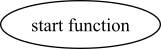
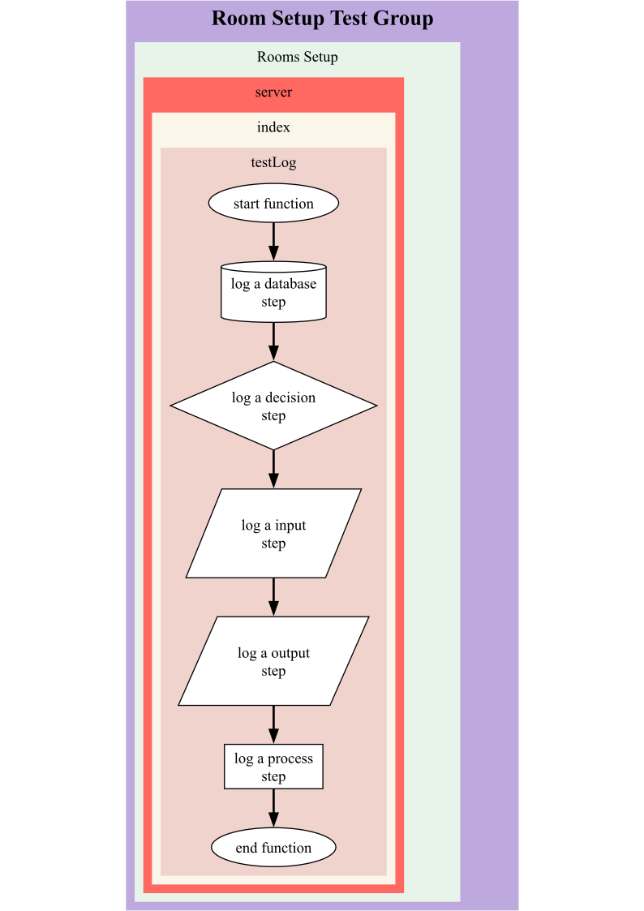

# Basic Logging

Logging is broken down into a number of simple steps

* `Start a log` or create a `branch of an existing log` for a function
* Add process steps, detailing the `logic of that function`, using common `flow diagram symbols`, for example:
	* Start
	* Database
	* Decision
	* Input/Output
	* Process
	* End

## Start Log

To initialise **FunkyWeave** `logging`, there are 4 required field and a set of optional variables that can be passed into the start function.

### Function Definition

Source: **funkyweave.logging**

Name: **startLog**

Parameters:
* **Description (string)**: A text description printed in the `node`. For example `start function`.
* **Group (string)**: Used to group one or more `flows` together. For example `page initialisation`, which would contain all flows run during the initialisation of a web-page. 
* **Flow (string)**: Used to group one or more `sources` together. For example, `query user data`, `query shopping items` and `render page` could all be seperate flows within the same `page initialisation` group.
* **Source (string)**: Used to group one or more `descriptions` together. For example, if you wished to seperate out `database queries`, `server functions` and `client-side functions`, each of these can exist as seperate sources within each flow.
* **Options (object) _Optional_**: A object that contains additional configurations information.
	* **parentLog (Log)**: A log instance that can be used to link one flow to another flow.
	* **offset (int)**: A value used to offset where on the parentLog the flow join is made. This value defaults to 0 if not provided, useful when defining `switch` logs.
	* **directLink (obj)**: A object that can be used to join one object to another without having to pass in a parentLog. This can be used if it impractical to pass logs between functions. 
	* **parentGroup (string)**: If you'd prefer to join one group to another to demonstrate the functional flow, use this parameter to identify that parentGroup.
	* **parentFlow (string)**: If you'd prefer to join one flow to another to demonstrate the functional flow, use this parameter to identify that parentGroup

```
const log = startLog(
	Description,
	Group,
	Flow,
	Source,
	{
		parentFlow,
		offset,
		directLink,
		parentGroup,
		parentFlow
	}
)
```

### Example

The below script is an example of how a user could initialise a `log instance` for use in a function:

```
const log = logger.start('start function', 'Room_Setup', 'Rooms_Setup', 'server')
```

When the `log` is `initialised`, it will automatically create a `start` node:

**Expected output:**



Log instances should be created in each function you wish to visualise later.


## Example Flow

Here's a simple example of a single flow script:

```
# Saved within an index.js file
const { logger, visualiser } = require('funkyweave')

const testLog = () => {
	const log = logger.start('start function', 'Room Setup Test Group', 'Rooms Setup', 'server')
	log.database('log a database step')
	log.decision('log a decision step')
	log.input('log a input step')
	log.output('log a output step')
	log.process('log a process step')
	log.end('end function')
}

testLog()
```

Which should produce a flow that looks like this:



## Enable Logging

Logging by default is enabled but can be toggled using the `FUNKY_LOGGING_ENABLED` environmental variable. To toggle logging off, use:

```
FUNKY_LOGGING_ENABLED=false
```

The above only works on server-script. You can use the function `setLogging` on the `logger` object to manually enable or disable logging. This method should be used `client-side`.