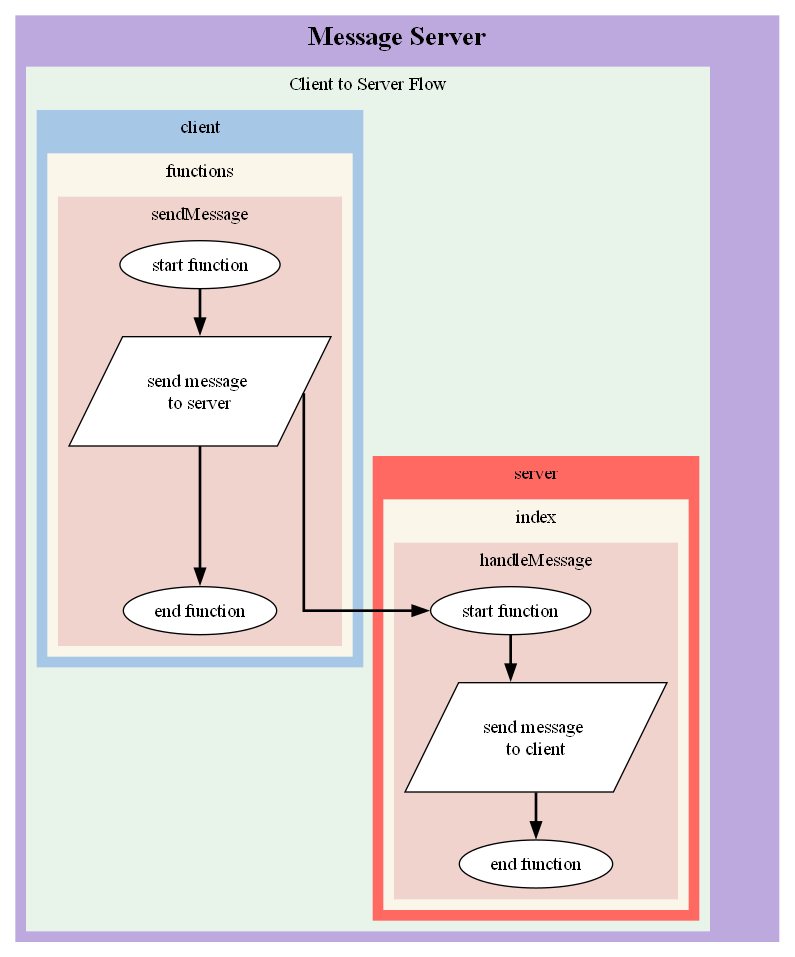

# Client-Side Logging

We wanted to allow users to access both `client` and `server` side logging so have created a client-side logger you can add into your project.

## Accessing the Logger

You can expose the script to the client by serving the file statically, we do so below via the `/vendor/funkyweave` folder but can of course be any location of your choosing.

### Example

Here's an example of how to include the client-side logger:

```
// Server-Side
const express = require('express')
const app = express()
const path = require('path')

app.use('/vendor/funkyweave', express.static(path.join(__dirname, 'node_modules/funkyweave/src/client')))

// Client-Side
import { logger } from '/vendor/funkyweave/logger.js';
```

## restart

There may be instances where you may need to `restart a log`, like when you're passing log data from client to server (or vis versa). Restarting a log will copy all existing `JSON data` from the transmitted log and re-apply it's associated logging functions. 

### Function Definition

Source: **funkyweave.logging**

Name: **restart**

Parameters: 

* **log (Log)**: The log you wish to restart.

### Example

Here's an example:

```
const log = logger.restart(TransmittedLog)
```

## setCallBack

One major difference of client logging is the way in which it needs to `save`. In order for data to be correctly saved in the servers `data` folder, you will need to set a `callBack` method within Logging, the first time it's called. The `callBack` method will be called whenever you use `end`, `endLoop` or `leaf` functionalities. The callBack function should include a `log` parameter so the logger can pass the completed data to it.

This system means that you can use any number of methods to communicate log data between the client to the server. We've included an example in this project which uses `socket.io` to communicate this data.

Source: **funkyweave.logging**

Name: **setCallBack**

Parameters: 

* **callBack (Function)**: The function you wish to run when a save needs to occur on the client-side.

### Example

#### File Structure
```
example_project
	| index.js
	| public
		checkMessages.js
		functions.js
	| views
		landing.ejs

```

#### Packages Required:

* body-parser
* ejs
* express
* socket.io
* funkyweave


#### index.js

```
const express = require('express')
const bodyParser = require('body-parser')
const socketio = require('socket.io')
const app = express()
const router = express.Router()
const { logger } = require('funkyweave')
const path = require('path')

const expressServer = app.listen(process.env.PORT || 80, process.env.IP, function () {
	console.log('server running')
})
const io = socketio(expressServer)

app.set('view engine', 'ejs') // set ejs as the view engine
app.use(bodyParser.urlencoded({ extended: true })) // setup body parser so it can read url parameters
app.use(bodyParser.json()) // allow the app to read json input into the body
app.use(express.static(`${__dirname}/public`)) // setup a public folder for js and css
// make funkyweave client folder accessible to client
app.use('/vendor/funkyweave', express.static(path.join(__dirname, 'node_modules/funkyweave/src/client')))


const handleMessage = (options) => {
	try {
		const log = logger.startBranch(options.log, 'start function', 'server')
		console.log('Message received')
		log.output('send message to client')
		log.end('end function')
	} catch (error) {
		console.log("Message Server Error:", error)
	}	
}

const checkMessages = (io, namespace) => {
	// when a user connects to the given namespace, do the following
	io.of(namespace).on('connection', (socket, req) => {
		// THIS IS A GENERIC MESSAGE HANDLER, ALLOWS CLIENT SIDE TO SEND VARIABLE FUNCTIONGROUP AND FUNCTION NAME TO RUN ON SERVER
		socket.on('message_server', (options) => {
			try {
				handleMessage(options)
				io.emit('message_client', {message: 'message from server'})
			} catch (error) {
				console.log("Message Server Error:", error)
			}
		})

		socket.on('remote_log', (options) => {
			const log = logger.restart(options.log)
			log.save()			
			console.log('REMOTE LOG recorded')
		})
	})
}

checkMessages(io, '/')

const landing = (req, res) => {
	res.render('landing')
}
router.get('/', landing)
app.use('/', router)

logger.clearFolder()
```

#### landing.ejs

```

<script src="/socket.io/socket.io.js"></script>

<script type="module">
	// Setup the ability to check socket messages
	import { checkMessages } from '/js/checkMessages.js'
	import { sendMessage } from '/js/functions.js'
	// import { logger } from '/js/logger.js'
	import { logger } from '/vendor/funkyweave/logger.js';
	const socketAddress = 'http://localhost:80'
	const socket = io(socketAddress, {transports: ["websocket", "polling"]})
	checkMessages(socket)
	
	// create a callback to run an emit when called
	const createCallback = (socket) => {
		return (log) => {
			socket.emit('remote_log', { message: 'this is a remote log message', log })
		}
	}
	// set callback as logger callback when 'save' is run
	logger.setCallBack(createCallback(socket))

    setTimeout(() => {
		sendMessage(socket)
    }, 4000);	
</script>

<div class="container">
	<h4>Landing Page</h4>
</div>
```

#### checkMessages.js

```
export const checkMessages = (socket) => {
	try {
		socket.on('message_client', (options) => {
			console.log(options)
		})

	} catch (error) {
		console.log("Message Server Error:", error)
	}
}
```

#### functions.js

```
import { logger } from '../vendor/funkyweave/logger.js';

export const sendMessage = (socket) => {
	const log = logger.start('start function', 'Message Server', 'Client to Server Flow', 'client')
	log.output('send message to server')
	socket.emit('message_server', {message: 'this is a message sent from the client', log})
	log.end('end function')
}
```

**Expected output:**

