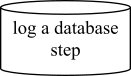

# Nodes

Once a `log` is created the following `node styles` are available.

Every time a node is created, **FunkyWeave** will also extract the `file name` and `function name` the log was used in, which you will see detailed within the `complete flow examples`.

## Database

Should be used when directly interacting with a database or other data source.

### Function Definition

Source: **funkyweave.log**

Name: **database**

Parameters:
* **Description (string)**: A text description printed in the `node`. For example "run step".
* **Leaf (boolean) _Optional_**: A bool controlling where the node is treated as a [Leaf](advanced_logging.md#leaf) or not.

```
log.database(
	Description,
	Leaf
)
```
### Example

Here's an example:

```
log.database('log a database step')
```
**Expected output:**



## Decision

A node that can be used when detailing any if statements.

### Function Definition

Source: **funkyweave.log**

Name: **decision**

Parameters:
* **Description (string)**: A text description printed in the `node`. For example "run step".
* **Leaf (boolean) _Optional_**: A bool controlling where the node is treated as a [Leaf](advanced_logging.md#leaf) or not.

```
log.decision(
	Description,
	Leaf
)
```
### Example

Here's an example:

```
log.decision('log a decision step')
```
**Expected output:**


## Input

A node to show when data is taken into a flow.

### Function Definition

Source: **funkyweave.log**

Name: **input**

Parameters:
* **Description (string)**: A text description printed in the `node`. For example "run step".
* **Leaf (boolean) _Optional_**: A bool controlling where the node is treated as a [Leaf](advanced_logging.md#leaf) or not.

```
log.input(
	Description,
	Leaf
)
```
### Example

Here's an example:

```
log.input('log a input step')
```
**Expected output:**


## Output

A node to show when data is output from a flow.

### Function Definition

Source: **funkyweave.log**

Name: **output**

Parameters:
* **Description (string)**: A text description printed in the `node`. For example "run step".
* **Leaf (boolean) _Optional_**: A bool controlling where the node is treated as a [Leaf](advanced_logging.md#leaf) or not.

```
log.output(
	Description,
	Leaf
)
```
### Example

Here's an example:

```
log.output('log a output step')
```
**Expected output:**


## Process

A node that covers basic flow steps that aren't defined using any other type of node.

### Function Definition

Source: **funkyweave.log**

Name: **process**

Parameters:
* **Description (string)**: A text description printed in the `node`. For example "run step".
* **Leaf (boolean) _Optional_**: A bool controlling where the node is treated as a [Leaf](advanced_logging.md#leaf) or not.

```
log.process(
	Description,
	Leaf
)
```
### Example
Here's an example:

```
log.process('log a process step')
```
**Expected output:**


## End

To end a flow and save it, create an `end` node. This will save the node to a `./data/flows` folder in the `root of your project`. To avoid duplicate files, `hashing` is used to generate filenames based on their content:

### Function Definition

Source: **funkyweave.log**

Name: **end**

Parameters:
* **Description (string)**: A text description printed in the `node`. For example "run step".

```
log.end(
	Description,
	Leaf
)
```
### Example
Here's an example:

```
log.end('log the end step')
```
**Expected output:**


