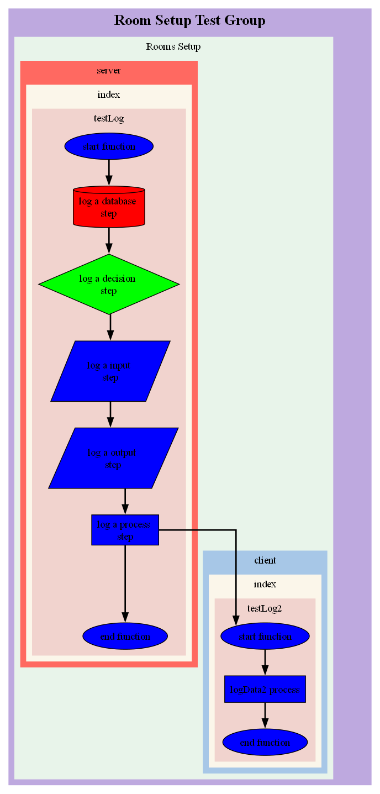

# Visualise

To render the files within the `./data/flow` folder, you need to use **FunkyWeave's** `visualiser` class.

## Function Definition

Source: **funkyweave.visualiser**

Name: **run**

Parameters:
* **fileName (str):** The output file name.
* **fileFormat (str):** The output file format which can be any dot rendering [file formats supported by graphViz](https://graphviz.org/docs/outputs/).
* **colours (object):** An object that allows you to set the colour value of all `Groups`, `Flows`, `Sources`, `Files`, `Functions` or `Flow Nodes` or colour specific sub-types within each of those groups. You can also include they key work `all` if you wish to `mix colouring` specific items while applying another colour to all other instance types.
	* **group (str | object) Optional:** Used colour names, hex values or provide an object with specific group names as keys, each with their own colour value.
	* **flow (str | object) Optional:** Used colour names, hex values or provide an object with specific flow names as keys, each with their own colour value.
	* **source (str | object) Optional:** Used colour names, hex values or provide an object with specific source names as keys, each with their own colour value.
	* **file (str | object) Optional:** Used colour names, hex values or provide an object with specific file names as keys, each with their own colour value.
	* **function (str | object) Optional:** Used colour names, hex values or provide an object with specific function names as keys, each with their own colour value.
	* **type (str | object) Optional:** Used colour names, hex values or provide an object with specific node type names as keys, each with their own colour value.			
* **rankdir (str) Optional:** Describes which direction you wisk to rank the nodes. This value defaults to `TB` (top to bottom). Any `rankdir` value [used by graphViz can be used here](https://graphviz.org/docs/attrs/rankdir/).

```
const log = visualiser.run(
	fileName,
	fileFormat,
	colours: {
		group,
		flow,
		source,
		file,
		function,
		type
	},
	rankdir
)
```

## Example

Here's a complete example of how to generate a flow then visualise it:

```
const { logger, visualiser } = require('funkyweave')

const testLog = () => {
	const log = logger.start('start function', 'Room Setup Test Group', 'Rooms Setup', 'server')
	log.database('log a database step')
	log.decision('log a decision step')
	log.input('log a input step')
	log.output('log a output step')
	log.process('log a process step')
	testLog2(log)
	log.end('end function')
}

const testLog2 = (parentLog) => {
	const log = logger.startBranch(parentLog, 'start function', 'client')
	log.process('logData2 process')
	log.end('end function')
}

function wait (ms) {
	return new Promise(resolve => setTimeout(resolve, ms))
}

async function run () {
	testLog()
	await wait(2000)

	const colours = {
		flow: '#E8F4EA', // green
		source: {
			server: '#FF6961', // red
			client: '#A7C7E7' // blue
		},
		class: '#FBF6EA', // orange
		function: '#F1D3CE', // light orange
		type: {
			all: 'blue',
			database: 'red',
			decision: 'green'
		}
	}

	const fileName = 'dot_image'
	const fileFormat = 'png'
	const rankdir = 'TB'

	visualiser.run(fileName, fileFormat, colours, rankdir)
}

run()
```

**Expected output:**

